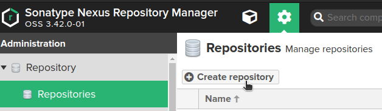
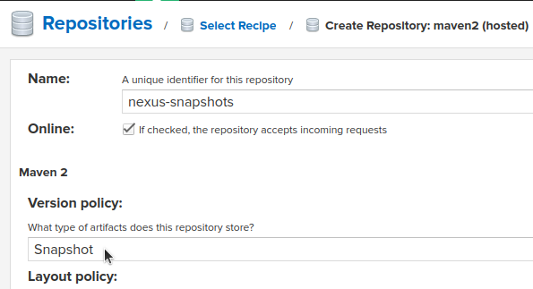
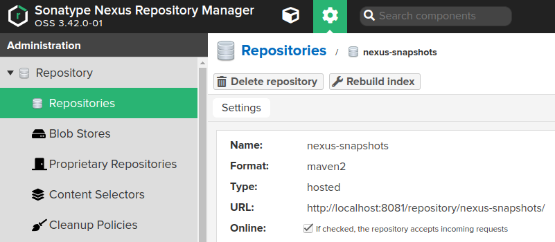
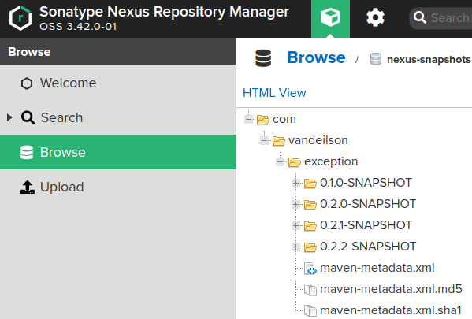
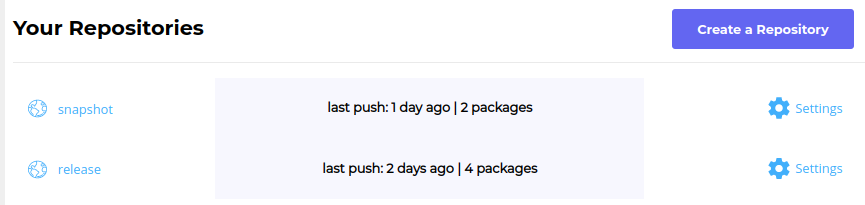
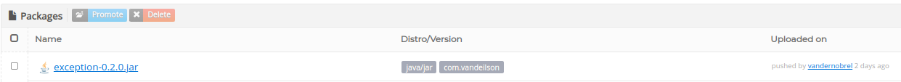

# **Deploying your project into a remote server**

#### The main purpose of this repository is to create a step-by-step guide on how to deploy your projects on remote servers. We will be deploying this current project into Nexus using Docker and also on the Package Cloud maven repository.

#### We will also have two different profiles configured, each one of them deploying into a different server, which we can choose where to deploy via command line.

### **Technologies used in this project**

- Maven
- Kotlin
- Spring Boot
- Docker
- Nexus
- Package Cloud

---
# 1 - Deploying to Nexus
### 1.1 - Setting up the repositories on Nexus

After cloning this project, open the terminal and run `docker-compose up -d` to start the local nexus container.<br>
Then, run `./retrieveInitialPassword.sh` to get the random password Nexus generated in order to be able to log in.
(it will be printed on the terminal, just copy it)<br>
<br>
Go to `localhost:8081`, log in using the password you just got and set a new password.<br>

<br>
Click on the gear on the left upper corner -> repository -> create repository:


<br><br>
##### Choose `maven2(hosted)` recipe, pick a name for your **snapshot repo** and make sure to change the `Version Policy` from `release` to `snapshot` (I chose `nexus-snapshots` for this project)
<br>

<br>
Create another repository, but with the version policy set to `Release` (I called it `nexus-releases`)
---

### 1.2 - Config Nexus server on settings.xml
Now that you have two repositories created (a snapshot one and a release one), open the `settings.xml` file
*(you can make these changes on your local settings.xml file, or you can use the one that already exists in the project)*
and write the following:
```xml
<settings xmlns="http://maven.apache.org/SETTINGS/1.1.0">
    <servers>
        <server>
            <id>nexus.snapshot</id>
            <username>admin</username>
            <password>${env.NEXUS_PASSWORD}</password>
        </server>
        <server>
            <id>nexus.release</id>
            <username>admin</username>
            <password>${env.NEXUS_PASSWORD}</password>
        </server>
    </servers>
</settings>
```

All you have to do is to set an ID name for your repo (it doesn't need to be same name as your actual repo),
and put your user and password.
---

### 1.3 - Config the pom.xml
Create a tag called `distributionManagement` under the main `project` tag and write the following:
```xml
<distributionManagement>
    <snapshotRepository>
          <id>nexus.snapshot</id>
          <url>http://localhost:8081/repository/nexus-snapshots/</url>
    </snapshotRepository>
    <repository>
          <id>nexus.release</id>
          <url>http://localhost:8081/repository/nexus-releases/</url>
    </repository>
</distributionManagement>
```

**Your repository ID needs to match the id you declared in the `settings.xml`**, and the url
can be found here:

---

### 1.4 - Deploy to Nexus
before deloying it to Nexus, pay attention on your project version on `pom.xml`: **if it has `SNAPSHOT` in the version, it
will be deployed to the SNAPSHOT repository, otherwise it will be deployed to the release repo**.
```xml
<groupId>com.vandeilson</groupId>
<artifactId>exception</artifactId>
<version>0.2.2-SNAPSHOT</version>
```
<br>

To deploy the project, run `mvn clean deploy -s ./settings.xml` (you can omit the `-s ./settings.xml` part if you prefer to use your local settings.xml file).
You can then browse on your repos to make sure the project is there:



---
# 2 - Deploying to Package Cloud
### 2.1 - Setting up the repositories on Package Cloud

Firstly, go to `https://packagecloud.io/` and create a free account. Once your logged in, click on `create repository` on the main page
and create two repositories: `snapshot` and `release`.


---
### 2.2 - Config Package Cloud server on settings.xml
Since we have already set up the nexus repository, things will get easy: Go to the `settings.xml` and, under
the tag `servers`, copy and paste the `server` config as given above:
```xml
<settings xmlns="http://maven.apache.org/SETTINGS/1.1.0">
    <servers>
        <server>
            <id>packagecloud.release</id>
            <password>${env.PACKAGECLOUD_PASSWORD}</password>
        </server>
        <server>
            <id>packagecloud.snapshot</id>
            <password>${env.PACKAGECLOUD_PASSWORD}</password>
        </server>
    </servers>
</settings>
```
---
### 2.3 - Config the pom.xml
Copy and paste the following under the main tag `project`:
```xml
<build>
    <extensions>
        <extension>
            <groupId>io.packagecloud.maven.wagon</groupId>
            <artifactId>maven-packagecloud-wagon</artifactId>
            <version>0.0.6</version>
        </extension>
    </extensions>
</build>

<distributionManagement>
    <snapshotRepository>
        <id>packagecloud.snapshot</id>
        <url>packagecloud+https://packagecloud.io/vandernobrel/snapshot</url>
    </snapshotRepository>
    <repository>
        <id>packagecloud.release</id>
        <url>packagecloud+https://packagecloud.io/vandernobrel/release</url>
    </repository>
</distributionManagement>
```
**Ok, very important thing: in the `url` you need to write `packagecloud+` + the actual repo url.**
<br>
---
### 2.4 - Deploy to Package Cloud
To deploy the project, run `mvn clean deploy -s ./settings.xml` (you can omit the `-s ./settings.xml` part if you prefer to use your local settings.xml file).
You can then browse on your repos to make sure the project is there:


---
# 3 - Using profiles to deploy to multiple servers
Ok, we have learned how to deploy our project into 2 different servers. But the thing is: we might want to
deploy either into one server or another. <br>
In this case the solution is to work with profiles: We will create one profile for each server!<br>

---

### 3.1 - Creating your profiles in pom.xml
Copy and paste the following under the main `project` tag:
```xml
<profiles>
    <profile>
      <id>local-nexus</id>
      <distributionManagement>
        <snapshotRepository>
          <id>nexus.snapshot</id>
          <url>http://localhost:8081/repository/nexus-snapshots/</url>
        </snapshotRepository>
        <repository>
          <id>nexus.release</id>
          <url>http://localhost:8081/repository/nexus-releases/</url>
        </repository>
      </distributionManagement>
    </profile>

    <profile>
      <id>package-cloud</id>
      <distributionManagement>
        <snapshotRepository>
          <id>packagecloud.snapshot</id>
          <url>packagecloud+https://packagecloud.io/vandernobrel/snapshot</url>
        </snapshotRepository>
        <repository>
          <id>packagecloud.release</id>
          <url>packagecloud+https://packagecloud.io/vandernobrel/release</url>
        </repository>
      </distributionManagement>
    </profile>
  </profiles>
```
The `id` tag is your profile name.<br>
To ensure everything is fine, run `mvn help:all-profiles` on the terminal and check if the two profiles are there:
```text
[INFO] Listing Profiles for Project: com.vandeilson:exception:jar:0.2.2-SNAPSHOT
  Profile Id: local-nexus (Active: false , Source: pom)
  Profile Id: package-cloud (Active: false , Source: pom)

[INFO] ------------------------------------------------------------------------
[INFO] BUILD SUCCESS

```

---

### 3.2 - Choosing where to deploy
Since no profile is active, if you run `mvn clean deploy -s ./settings.xml`, **an error will happen!** So, you have to tell maven which profile you want to use (and, consequently, which server you are deploying into.)
<br>
You can use the flag `-P` to do this, like the following:<br>
`mvn clean deploy -Plocal-nexus -s ./settings.xml` to deploy to you local nexus, and<br>
`mvn clean deploy -Ppackage-cloud -s ./settings.xml` to deploy to package cloud.

---
### 3.3 - Setting a profile as Active
If you don't want to write the profile everytime you run a command, write the following under the `profile` tag to make one profile always active.<br>
```xml
<profile>
      <id>package-cloud</id>
      <activation>
        <activeByDefault>true</activeByDefault>
      </activation>
...
...
...

```
By doing this, when you run `mvn clean deploy -s ./settings.xml`, the project will get the server info from your default active profile.
<br>**So, you only have to write the profile when you desire to deploy into a different server!**

---

# 4 - Using your lib in other projects

First of all, go to your local maven repository (under the `.m2` folder) and delete your lib (just for academics purposes).
We're doing this because whn we deploy a component, maven install it first in our local maven repository, and we're trying to simulate
a scenario where you are trying to import a lib that you normally don't have installed it in your computer.
<br>Just keep in mind that maven will try to get your dependencies from your local maven repository before
looking it in the servers you have configured.

---
Secondly, under the main `project` tag, copy this into your `pom.xml`:
```xml
<repositories>
    <repository>
        <id>nexus.snapshot</id>
        <url>http://localhost:8081/repository/nexus-snapshots/</url>
    </repository>
    <repository>
        <id>nexus.release</id>
        <url>http://localhost:8081/repository/nexus-releases/</url>
    </repository>
</repositories>
```

And for the last step, go to the `dependencies` tag, put your libs coordinates and import it.
```xml
<dependency>
    <groupId>com.vandeilson</groupId>
    <artifactId>exception</artifactId>
    <version>0.2.2-SNAPSHOT</version>
</dependency>
```

Make sure you have the servers configured properly on your computer, or create a `settings.xml` file with the servers on it.